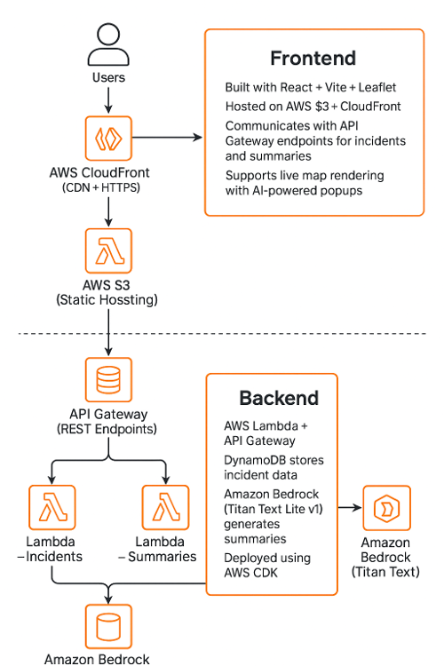

# 🛰️ RescueMind – AI-Powered Disaster Response Map

**Live Demo:** [https://d2xbkuqehmb0br.cloudfront.net](https://d2xbkuqehmb0br.cloudfront.net)  
**API Endpoint:** [https://tj3yov0q6h.execute-api.us-east-1.amazonaws.com/prod](https://tj3yov0q6h.execute-api.us-east-1.amazonaws.com/prod)

---

## 🚨 Overview

**RescueMind** is a fully serverless, AI-powered disaster response platform that visualizes real-time emergencies and automatically generates action plans using **Amazon Bedrock (Titan Text Lite v1)**.  
Each incident appears on an interactive **Leaflet** map with an **AI-generated summary** to help responders quickly prioritize interventions.

---

## 🎨 Features

- 🗺️ Real-time interactive map (Leaflet + React)  
- 🎯 Color-coded incident markers by status  
- 🤖 AI-generated summaries and response plans (Amazon Bedrock)  
- ☁️ Fully serverless architecture (Lambda, DynamoDB, API Gateway, S3, CloudFront)  
- 🧩 Extensible — easily add new cities or alerts  

---

## 🧱 Architecture

### **Frontend**

- Built with **React + Vite + Leaflet**  
- Hosted on **AWS S3**, distributed via **CloudFront**  
- Communicates with **API Gateway** for incident and summary endpoints  
- Displays live map rendering with AI-powered popups  

### **Backend**

- **AWS Lambda** functions behind **API Gateway**  
- **DynamoDB** stores all incident data  
- **Amazon Bedrock (Titan Text Lite v1)** generates summaries  
- Fully deployed using **AWS CDK**  

📘 *Architecture Diagram:*  


---

## 🔗 API Endpoints

| Method | Path | Description |
|:-------|:-----|:-------------|
| GET | `/mapdata` | Returns all active incidents |
| POST | `/summarize` | Generates AI summary + action plan |

**Example request:**
```bash
curl -X POST https://tj3yov0q6h.execute-api.us-east-1.amazonaws.com/prod/summarize \
  -H "Content-Type: application/json" \
  -d '{"text": "Flood alert in Miami. Evacuation recommended near downtown."}'
```

**Example response:**
```json
{
  "summary": "Emergency message: Flood alert in Miami near downtown. Evacuation recommended. Action plan: monitor updates, prepare emergency kits, follow local authorities' instructions."
}
```

---

## 🗺️ Adding New Incidents

Add a new incident to DynamoDB via AWS CLI:
```bash
aws dynamodb put-item \
  --table-name RescueMind-Data-IncidentsTable \
  --item '{
    "incidentId": {"S": "INC-020"},
    "type": {"S": "wildfire"},
    "city": {"S": "San Diego"},
    "latitude": {"N": "32.7157"},
    "longitude": {"N": "-117.1611"},
    "status": {"S": "active"}
  }'
```

Or batch upload:
```bash
aws dynamodb batch-write-item --request-items file://scripts/incidents-batch.json
```

Verify data:
```bash
curl https://tj3yov0q6h.execute-api.us-east-1.amazonaws.com/prod/mapdata
```

---

## 🚀 Deployment Guide

### **Backend (CDK)**
```bash
cd cdk
npx cdk bootstrap
npx cdk deploy --all
```

### **Frontend (React + Vite)**
```bash
cd frontend
npm ci
npm run build
aws s3 sync build/ s3://rescuemind-frontend-bucket --delete
aws cloudfront create-invalidation --distribution-id YOUR_DIST_ID --paths "/*"
```

✅ Ensure API Gateway CORS settings:
```
Allowed Origin  → https://d2xbkuqehmb0br.cloudfront.net
Allowed Methods → GET, POST, OPTIONS
Allowed Headers → Content-Type
```

Redeploy:
```bash
aws apigateway create-deployment --rest-api-id tj3yov0q6h --stage-name prod
```

---

## 🧠 Troubleshooting & Fixes

| Challenge | Resolution |
|:-----------|:------------|
| Lambda ES-module import errors | Converted to CommonJS, adjusted `package.json` |
| Bedrock access denied | Added `bedrock:InvokeModel` to Lambda IAM policy |
| JSON body parsing errors | Implemented safe event parsing in summarizer Lambda |
| Missing map markers | Fixed `/mapdata` response formatting |
| “Failed to fetch summary” | Enabled proper CloudFront CORS configuration |
| Build failure with Vite | Upgraded Node to v20.19 |
| Timeout on summarizer | Increased Lambda memory & timeout |
| 404 favicon / marker icons | Corrected asset paths in Vite build output |

---

## 🧠 Role of GPT-5

GPT-5 provided engineering assistance for:

- AWS CDK refactoring and IAM design  
- Lambda debugging and Bedrock integration  
- API Gateway + CloudFront CORS setup  
- Leaflet frontend rendering optimization  
- Deployment automation (S3 + CloudFront)  

---

## 🧹 Cleanup

To remove all AWS resources and avoid costs:
```bash
cd cdk
npx cdk destroy --all
```

---

## 🏗 Best Practices

✅ Infrastructure as Code with AWS CDK  
✅ Event-driven microservices (Lambdas + EventBridge)  
✅ Least-privilege IAM roles  
✅ Well-Architected Framework compliance  

---

## 🙏 Acknowledgment

Developed by **[@Sekedoua]** as part of the **AWS AI/ML Hackathon 2025**.  
AI-assisted with **ChatGPT (GPT-5)** for architecture design, development, and documentation.

---

## 📜 License

**MIT License © 2025 RescueMind Team**  
“Built by [@Sekedoua], with AI-assisted development and design.”
