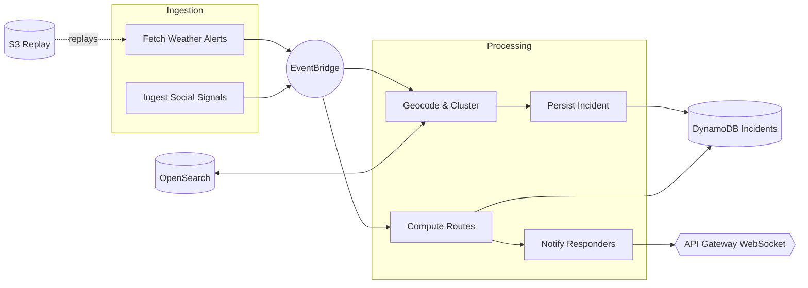

# 🚨 RescueMind — AI-Powered Emergency Response

Plateforme serverless qui **ingère des signaux en temps réel** (météo, social, IoT), **géocode / clusterise** les incidents, **calcule des routes** et **notifie** les secours.  
Infra déployée avec **AWS CDK** (Lambda, DynamoDB, S3, EventBridge, OpenSearch, API Gateway WebSocket).

---

## 🧩 Architecture (Mermaid)



---

## 📦 Stacks CDK

- **RescueMind-Data** : DynamoDB (incidents), S3 (replay), EventBridge, OpenSearch, Location PlaceIndex.
- **RescueMind-Agent** : Lambdas métier (fetch, geocode, compute, persist, notify) + permissions & variables d’env.
- **RescueMind-Api** : API Gateway **WebSocket** (diffusion vers les clients), Lambda `get_incidents`.

---

## 📂 Structure du projet

```
rescuemind/
├─ cdk/
│  ├─ bin/
│  │  └─ app.ts                 # Point d’entrée CDK (instancie les 3 stacks)
│  ├─ lib/
│  │  ├─ data-plane.ts          # RescueMind-Data
│  │  ├─ agent.ts               # RescueMind-Agent
│  │  └─ api.ts                 # RescueMind-Api
│  └─ package.json
│
├─ lambdas/
│  ├─ fetch_weather_alerts/
│  │  ├─ index.ts|js
│  │  └─ package.json
│  ├─ geocode_and_cluster/
│  │  ├─ index.ts|js
│  │  └─ package.json
│  ├─ compute_routes/
│  │  ├─ index.ts|js
│  │  └─ package.json
│  ├─ persist_incident/
│  │  ├─ index.ts|js
│  │  └─ package.json
│  ├─ notify_responders/
│  │  ├─ index.ts|js
│  │  └─ package.json
│  └─ get_incidents/
│     ├─ index.ts|js
│     └─ package.json
│
├─ __tests__/                    # Tests Jest
│  ├─ fetch_weather_alerts.test.ts
│  ├─ geocode_and_cluster.test.ts
│  ├─ compute_routes.test.ts
│  ├─ persist_incident.test.ts
│  ├─ ingest_social_signals.test.ts
│  ├─ notify_responders.test.ts
│  └─ sample.test.ts
│
├─ docs/
│  ├─ architecture.mmd           # source du diagramme Mermaid
│  └─ architecture.png           # export optionnel
│
├─ jest.config.js
├─ tsconfig.json
├─ package.json
└─ README.md
```

---

## ✅ Prérequis

- Node.js ≥ 18
- AWS CLI configuré (`aws configure`)
- CDK installé :  
  ```bash
  npm i -g aws-cdk
  ```

---

## ⚙️ Installation & Déploiement

```bash
# 1) Installer les dépendances CDK
cd cdk
npm install

# 2) Bootstrap (une fois par compte/region)
npx cdk bootstrap

# 3) Synthèse (vérifie que tout compile)
npx cdk synth

# 4) Déploiement (tous les stacks)
npx cdk deploy --all
```

> Pour déployer un stack spécifique :  
> `npx cdk deploy RescueMind-Data` (ou `RescueMind-Agent`, `RescueMind-Api`)

---

## 🧪 Tests (Jest)

À la racine du repo :

```bash
npm install
npm test
```

> Les tests utilisent `aws-sdk-client-mock` pour stubber les clients AWS v3.

---

## 🔧 Variables d’environnement (Lambdas)

- `TABLE_INCIDENTS` / `TABLE_NAME` : table DynamoDB incidents
- `REPLAY_BUCKET` : bucket S3 de replay (fixtures)
- `PLACE_INDEX_NAME` : AWS Location PlaceIndex
- `OPENSEARCH_ENDPOINT`, `OPENSEARCH_INDEX` : cible d’ingestion

---

## 🧹 Nettoyage (éviter les coûts)

```bash
cd cdk
npx cdk destroy --all
```

---

## 📜 Licence

MIT
