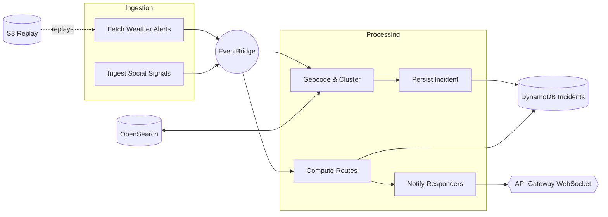

# 🚨 RescueMind — AI-Powered Emergency Response

Serverless platform that **ingests real-time signals** (weather, social, IoT), **geocodes / clusters** incidents, **computes routes**, and **notifies responders**.  
Infrastructure deployed with **AWS CDK** (Lambda, DynamoDB, S3, EventBridge, OpenSearch, API Gateway WebSocket).

---

## Overview  
RescueMind is an AI/ML-driven disaster response system built on AWS.  
It enables real-time ingestion, clustering, and visualization of incident data from multiple sources.  
The system leverages **AWS Lambda, DynamoDB, OpenSearch, S3, API Gateway, and EventBridge**, with AI-driven geocoding and clustering for faster emergency response.  

## Architecture  
  

- **Data Ingestion** – Collects alerts, reports, and signals.  
- **AI Geocoding & Clustering** – Identifies hotspots and computes optimal responder routes.  
- **Persistence** – Stores incidents in DynamoDB and indexes signals in OpenSearch.  
- **Real-Time APIs** – WebSocket + REST APIs for responders and dashboards.  
- **Replay & Analysis** – S3-based incident replay for audits and simulations.  

## Deployment  
The project is deployed on AWS with three core stacks:  
- `RescueMind-Data` – Data storage and EventBridge bus.  
- `RescueMind-Agent` – Lambda functions for AI-driven workflows.  
- `RescueMind-Api` – REST + WebSocket APIs for interaction.  

**Deployed API URLs:**  
- REST API: `https://of1o0i1ui0.execute-api.us-east-1.amazonaws.com`  
- WebSocket API: `wss://6dv0u3d6l9.execute-api.us-east-1.amazonaws.com/dev`  

## Demo Video  
👉 [Watch the video presentation here](#) _(link to MP4 once uploaded)_  

## 🧩 Architecture (Mermaid)



---

## 📦 CDK Stacks

- **RescueMind-Data**: DynamoDB (incidents), S3 (replay), EventBridge, OpenSearch, Location PlaceIndex.
- **RescueMind-Agent**: Business Lambdas (fetch, geocode, compute, persist, notify) + permissions & env vars.
- **RescueMind-Api**: **WebSocket API Gateway** (broadcasts to clients), Lambda `get_incidents`.

---

## 📂 Project Structure

```
rescuemind/
├─ cdk/
│  ├─ bin/
│  │  └─ app.ts                 # CDK entry point (instantiates the 3 stacks)
│  ├─ lib/
│  │  ├─ data-plane.ts          # RescueMind-Data
│  │  ├─ agent.ts               # RescueMind-Agent
│  │  └─ api.ts                 # RescueMind-Api
│  └─ package.json
│
├─ lambdas/
│  ├─ fetch_weather_alerts/
│  │  ├─ index.ts|js
│  │  └─ package.json
│  ├─ geocode_and_cluster/
│  │  ├─ index.ts|js
│  │  └─ package.json
│  ├─ compute_routes/
│  │  ├─ index.ts|js
│  │  └─ package.json
│  ├─ persist_incident/
│  │  ├─ index.ts|js
│  │  └─ package.json
│  ├─ notify_responders/
│  │  ├─ index.ts|js
│  │  └─ package.json
│  └─ get_incidents/
│     ├─ index.ts|js
│     └─ package.json
│
├─ __tests__/                    # Jest tests
│  ├─ fetch_weather_alerts.test.ts
│  ├─ geocode_and_cluster.test.ts
│  ├─ compute_routes.test.ts
│  ├─ persist_incident.test.ts
│  ├─ ingest_social_signals.test.ts
│  ├─ notify_responders.test.ts
│  └─ sample.test.ts
│
├─ docs/
│  ├─ architecture.mmd           # Mermaid source diagram
│  └─ architecture.png           # optional export
│
├─ jest.config.js
├─ tsconfig.json
├─ package.json
└─ README.md
```

---

## ✅ Requirements

- Node.js ≥ 18
- AWS CLI configured (`aws configure`)
- CDK installed:  
  ```bash
  npm i -g aws-cdk
  ```

---

## ⚙️ Installation & Deployment

```bash
# 1) Install CDK dependencies
cd cdk
npm install

# 2) Bootstrap (once per account/region)
npx cdk bootstrap

# 3) Synthesize (compile & check)
npx cdk synth

# 4) Deploy (all stacks)
npx cdk deploy --all
```

> To deploy a specific stack:  
> `npx cdk deploy RescueMind-Data` (or `RescueMind-Agent`, `RescueMind-Api`)

---

## 🧪 Testing (Jest)

From the repo root:

```bash
npm install
npm test
```

> Tests use `aws-sdk-client-mock` to stub AWS SDK v3 clients.

---

## 🔧 Environment Variables (Lambdas)

- `TABLE_INCIDENTS` / `TABLE_NAME`: DynamoDB incidents table
- `REPLAY_BUCKET`: S3 replay bucket (fixtures)
- `PLACE_INDEX_NAME`: AWS Location PlaceIndex
- `OPENSEARCH_ENDPOINT`, `OPENSEARCH_INDEX`: ingestion target

---

## 🧹 Cleanup (avoid AWS costs)

```bash
cd cdk
npx cdk destroy --all
```

---

## 🏗 Architecture & Best Practices

This project has been reviewed against the [AWS Well-Architected Framework](https://aws.amazon.com/architecture/well-architected/).

**Summary:**
- ✅ Infrastructure as Code (AWS CDK)
- ✅ Event-driven microservices (Lambdas + EventBridge)
- ✅ Least-privilege IAM for Lambdas
- ⚠️ Monitoring & DLQs still to be added
- ⚠️ Secrets should be stored in AWS Secrets Manager
- ⚠️ OpenSearch HA & cost governance under review

👉 See [docs/WAF-Review.md](docs/WAF-Review.md) for the full detailed review.

## Acknowledgment  

This project was developed by [@Sekedoua] as part of the **AWS AI/ML Hackathon**.  
We leveraged **AI tools (ChatGPT)** for support in **code generation, cloud architecture design, documentation, and media creation**.  


## 📜 License

MIT

*"Built by [@Sekedoua], with AI-assisted development and design."*
